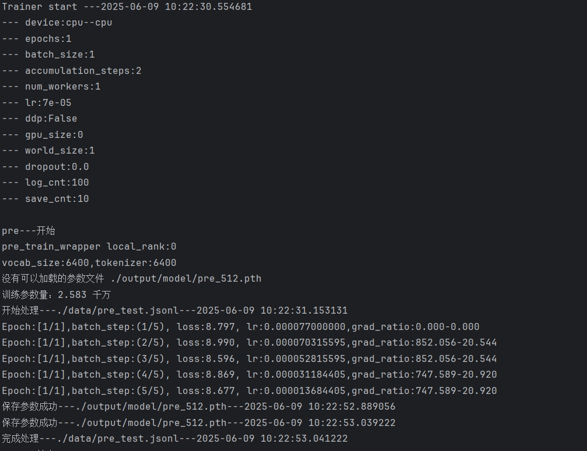
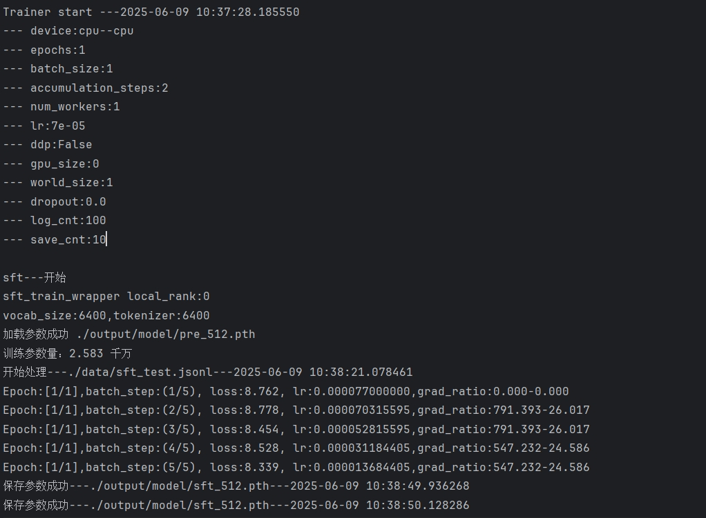
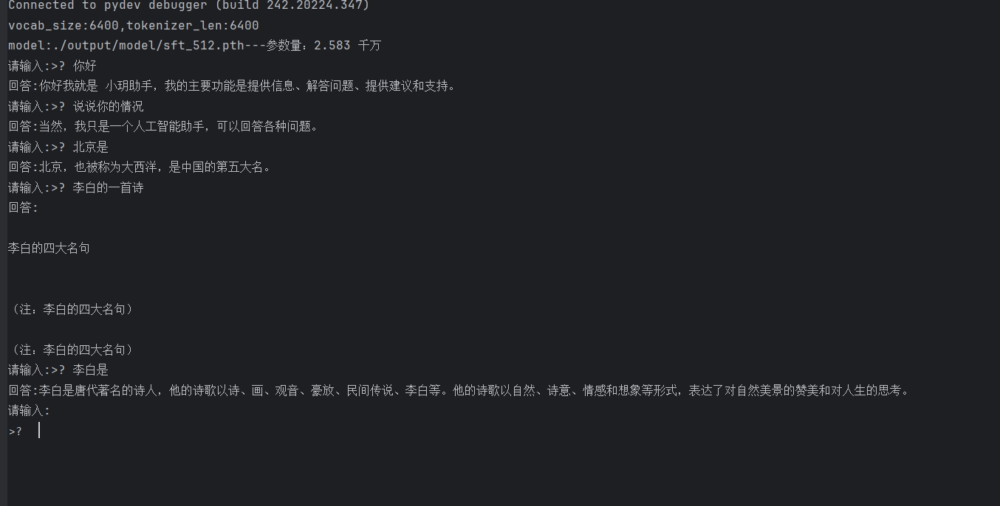

首先感谢MiniMind,https://github.com/jingyaogong/minimind  
MiniMind项目的代码和训练过程非常适合观看和学习，本项目从此项目中获得了很多帮助。
因为这个项目的很多思路来源于MiniMind，故名LittleMind，也希望此项目可以由小而大的学习成长。    

训练：  
可以直接运行python LittleTrainer.py --mode pre  --data_path ./data/xxx.jsonl
mode：训练模式 pre,sft,dpo,orpo  
data_path：数据集文件地址  
其他参数可以参考代码中的 set_train_args方法  
目前pre sft支持checkpoint，dpo和orpo暂不支持  

测试：
可以直接运行python test.py  --mode pre  
mode：读取哪个训练下的model文件 pre,sft  

最后是训练数据和测试效果，如下
  
   
   
   
   
