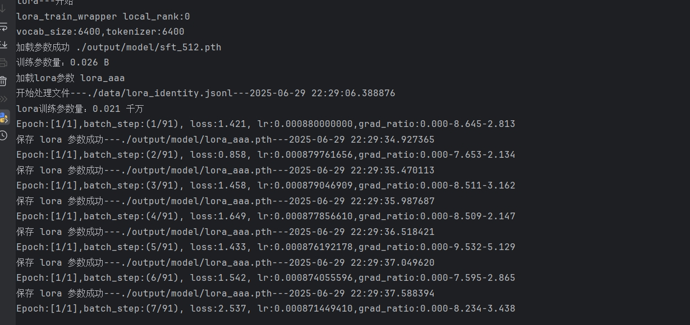
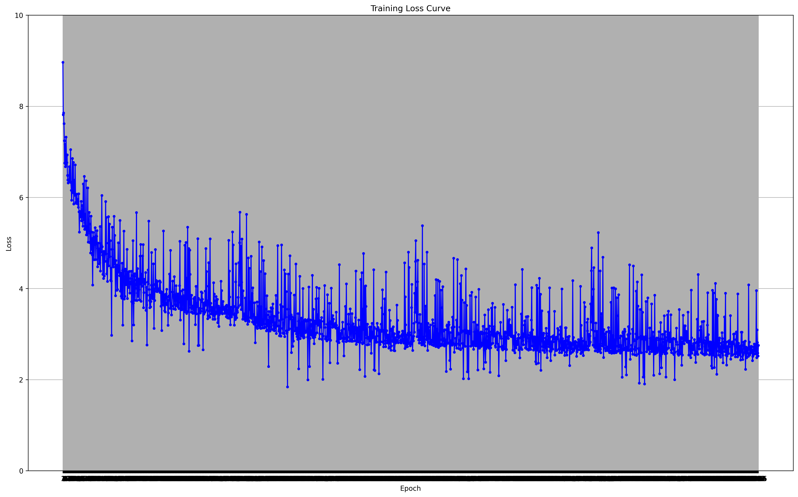
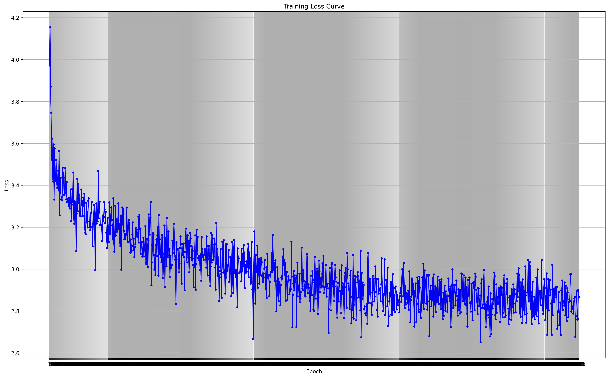
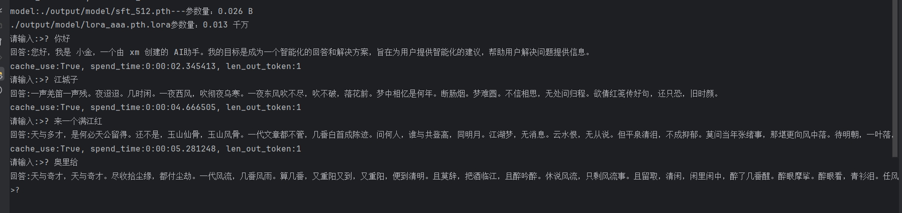

首先需要感谢MiniMind项目 https://github.com/jingyaogong/minimind    
MiniMind代码简练易懂，有非常清晰的学习路径，非常适合学习测试。本项目从minimind中获得了很多经验。  

如何训练:  
首先需要切换当前目录为项目路径  
cd xxx/xxx/xxx  

然后运行命令   
python LittleTrainer.py --mode pre  --data_path ./data/xxx.jsonl  --dim 512  --layernum 8  
pre训练数据集的数据格式可以参考 /data/pre_test.jsonl  

参数说明:  
--mode pre ,pre模式  
--mode sft ,sft模式  
--mode lora ,lora模式(--lora_name lora模型名称，lora模式不可为空，还需要有一个pre或者sft模型)    
--data_path ./data/xxx.jsonl , 训练数据集文件地址   
--dim 512 ,模型维度 默认512  
--layernum 8,模型层数 默认8  
其他参数请看LittelTrainer.py中设置参数的代码  
预训练日志  
   

全参数微调日志  
     

lora微调日志  
     

下载训练数据集:  
1、魔搭社区 数据集 搜索minimind   
注意，此项目目前还没提供tokenizer训练，只能使用现有的（可以直接使用minimind代码）。bos,eos都使用的是qwen风格  

1、pre sft支持checkpoint，dpo和orpo目前还不支持    
--train_id xxxx (训练任务id，此参数功能必需)  
--num_checkpoint 10 (每个eopchs 的保存次数.如果设置为0的话，不保存checkpoint)  
--checkpoint_interval 100（每n步进行一次 checkpoint  此参数功能必需）   

2、提供单机多卡功能(ddp)，同样目前只支持pre,sft 
参数：  
--ddp 1  (--ddp 0 不支持)  
--world_size 2 (gpu数量)  

如何测试:  
可以直接运行python LitterGeneration.py  --mode pre --dim 512 --layernum 8     
--mode pre ,读取pre模式训练的model文件并进行推理  
--mode sft ,读取sft模式训练的model文件并进行推理  
--dim 512 ,模型维度,默认512(与训练时使用的参数相同) 
--layernum 8,模型层数 ,默认8(与训练时使用的参数相同) 

训练数据pre loss   
    
sft loss  
    
推理效果  
     
lora微调  
     
